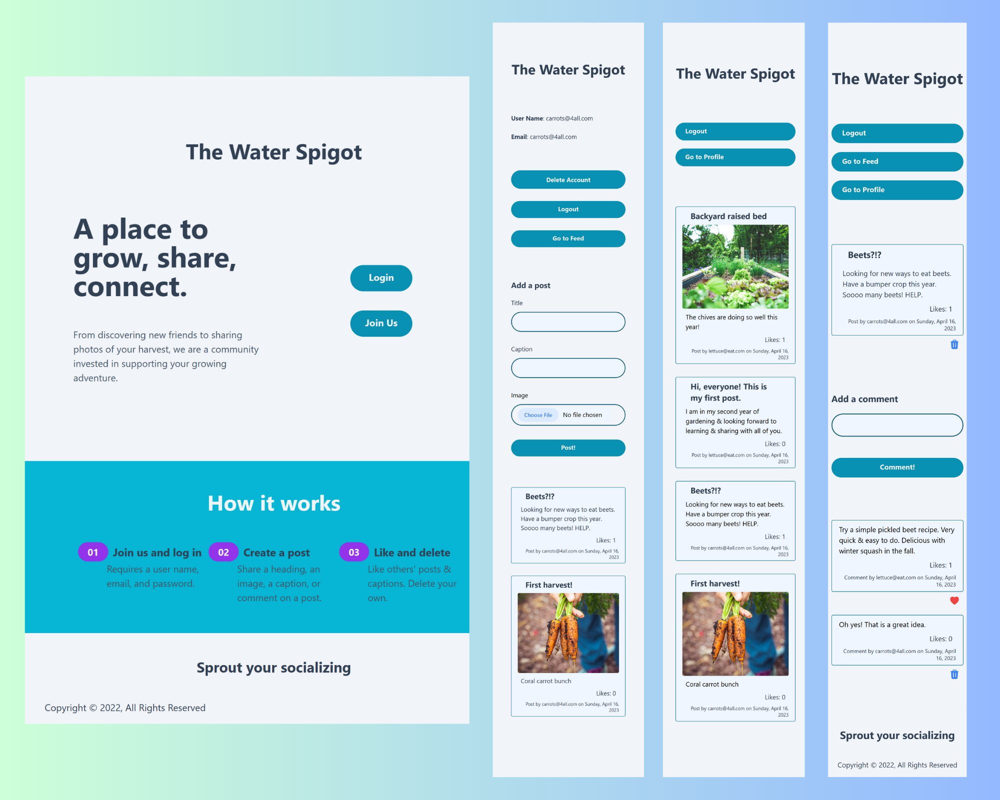

## The Water Spigot Social Network

A place to grow, share, connect.
Social messaging and photo sharing app for home veg growers.

### Built With

- 
- 
- 
- 
- 
- 
- 

## How it works

- [ ] Sign up and log in
  - [ ] Requires a user name, email, and password. \*delete account if desired
- [ ] Create a post
  - [ ] Share a heading, an image, a caption, or comment on a post.
- [ ] Like and delete
  - [ ] Logged in users can like others' posts & comments and delete their own.
